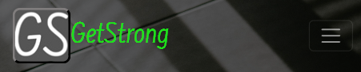
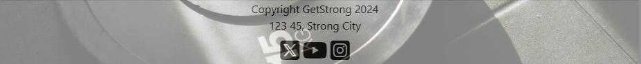
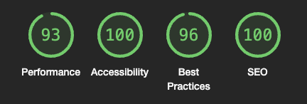
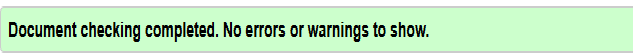
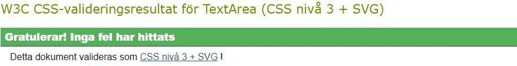
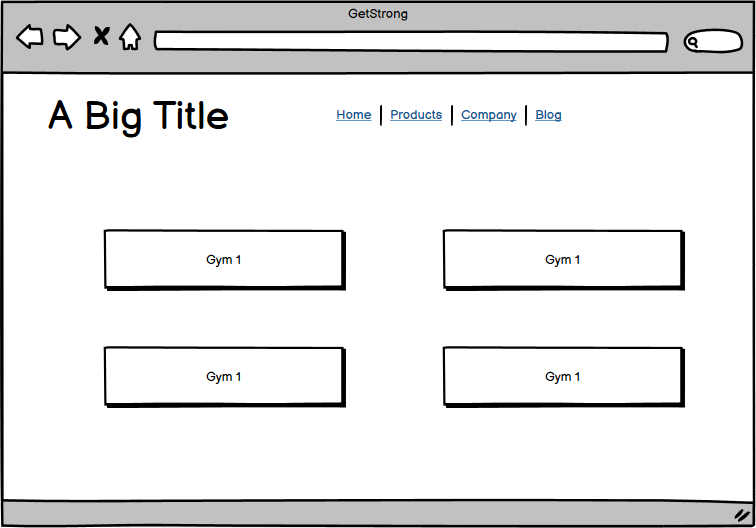
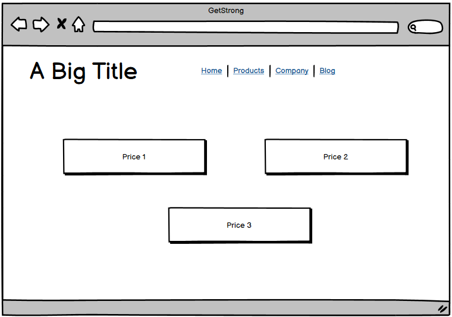
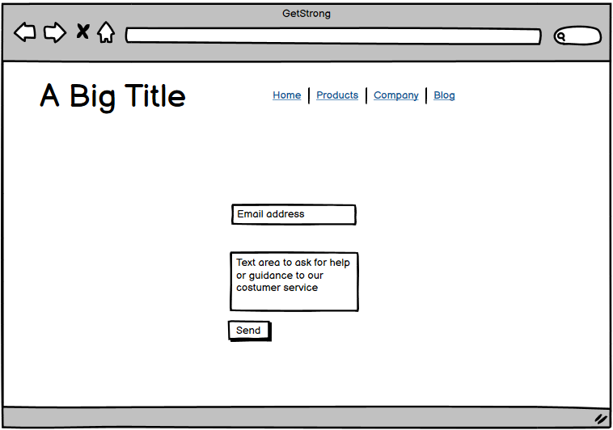
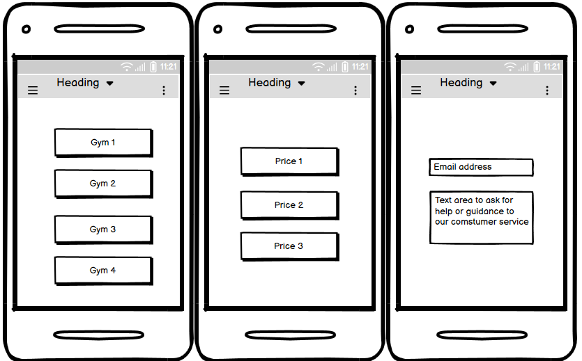

# GetStrong

## Table of contents

1. Goals
2. Target Audience
3. User goals
4. Features
5. Manual testing
6. Validation and lighthouse reports

## Project goals

The primary goal for GetStrong is a clean and informative website to expand the brand and gym, and for new potential members to sign up for a membership online and personal training sessions.

### Target audience

Main audience is people that wants to improve themself and their health and be able to get information and be able to sign up online for a membership and personal training sessions.

### User goals:

* Get information about the gym
* Forms to sign up for membership
* Social links to be able to follow GetStrong's journey
* Additional information about the gym

### Features

* Navigation bar at top for quick and easy navigation through the site: 
For laptops/desktop: 

For smaller screen it appears with a burgericon and a dropdown menu: 

 
* The homepage is information about where we are located in Sweden
* Footer provides copyright information and social media links: 

* In the contact page there is a form to provide user access to get in touch with GetStrong 
with any question they might have.

### Manual testing

* I have manually tested all the links and buttons on the website

| Feature  | Excpect  | Action  | Result  |
|:---|:---:|:---:|---:|
|  Navbar links | When you click a link it  should redirect to relevant page  | Clicked all links manually  |  Redirects to  relevant page |
|  Social links | Open the link in a new window  | Clicked the link manually  | Opened in a new window  |
|  Contact Form | Email verification, input required and send the form  | Tried providing a  email and question   | Works as intended  |

### Deployment

* All code was written in github editor, to deploy the website the following steps was used: 
    1. In the Github repository, go to Settings
    2. From the menu to the left, click "Pages"
    3. Under "Default branch", make sure it says "Main" and save.
    4. Go back to the repository and update, under deployment to the right, it should say "github-pages" with a green checkmar.
    5. If it doesn't show, try to update the site again as it takes a while sometimes.

### Final testing 

* Lighthouse testing: 

* Validator testing:
    - HTLM Validation: Passed without any error. It says the links are empty due to the face there is only a picture of the relevant social media platform.
     
    
    - CSS Validation: Passed without any errors. 
    
    - Screensize responsiveness is tested in the browser down to 280px

### Wireframes

* Wireframes created in [Balsamiq](https://balsamiq.com/wireframes/desktop/#) for different screensizes 
Tablets and larger screens: 
 
 
 
 
Mobile devices: 
 

* The wireframe is a starting idea and the final design was improved along with the project for better visuals.
### Bugs

* No bugs where discovered.

### Credits 

* A big thank you to my mentor Spencer and Kay for supporting me while building this
* Images are from [Pexels](https://www.pexels.com/sv-se/) 
* Applies to tutorials as well
* Used the tutorial provided by Code Institute, https://www.youtube.com/watch?v=l1DE7L-4eKQ
* Bootstrap documentation and the [Bootstrap library](https://getbootstrap.com/docs/5.3/getting-started/introduction/), version 5.
* Icons taken from [Font Awesome](https://fontawesome.com/)
* Cheat sheet I used for readme file: https://www.markdownguide.org/cheat-sheet/
* Inspiration for the readme file from [SophieTiger](https://github.com/SophieTiger/optimal_health)
### Future features

* In the future, I would like to add a members section with an option to log in as a member where you can track your progress, training history.
* A reward system for active members
* Mobile application for even easier access to information and members section.

